# レポート原稿

## はじめに

この記事は、2025年度冬学期に実施された東京大学工学部電子情報・電気電子工学科の学生実験「大規模ソフトウェアを手探る」の
成果レポートを兼ねています。

この実験では、Visual Studio Code のソースコードをいじることで
2つの新機能を追加しました。

ここでは、コードの clone から機能の完成まで、その過程を余すことなくお伝えしていきます。
同じようなことをやろうと考えている方の参考になれば幸いです！

## Visual Studio Code とは？

Visual Studio Code (以下 vscode) は、Microsoft が開発しているソースコードエディタです。

最大の特徴はその圧倒的な人気度で、
Stack Overflow で実施された 2025 Developer Survey では、
開発環境として 75.9 % の支持を集め、
次点に 2.6 倍以上の差をつけてトップの人気となりました。

また、vscode はソースコードが [github](https://github.com/microsoft/vscode) 上で公開されています。
今回はこのレポジトリを clone してきて、新機能を開発していくことになります。

※ Microsoft が配布しているソフトウェアとしての vscode は、公開されているソースコードにカスタマイズを加えたものになっているため、公開されているソースコードをビルドしたものと完全に同じではありません。

## 今回目指したこと

今回は大きく分けて次の2つの機能を実装することを目指しました。

- 機能1. Tab キーで名前の変更を連続して行う
- 機能2. 巨大ファイルをメモリ消費を抑えつつプレビューする

### 機能1 について

Windows のエクスプローラでは、ファイルの名前を変更中に Tab キーを押すと１つ下のファイルの名前の変更を行う状態へと移ることができます。
この機能は複数のファイル名を変更したい場合にとても便利なのですが、vscode ではこれができません。
ないものは作ろう、ということでこれを vscode にも実装するのが１つ目の目標になります。

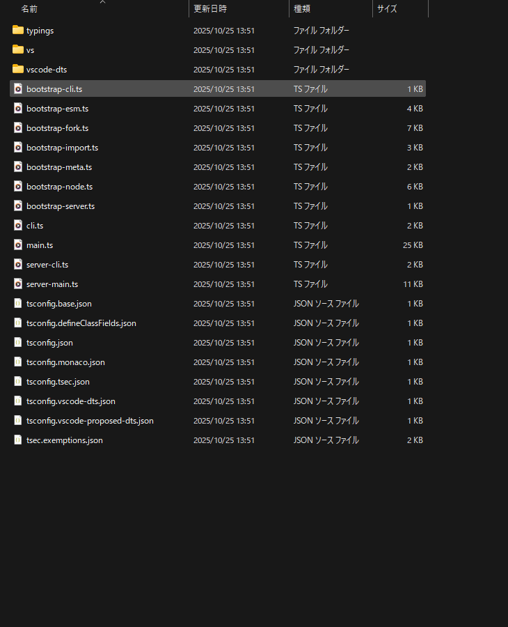

### 機能2 について

2つ目の目標は、巨大ファイルをメモリ消費を抑えつつプレビューする機能の実装です。
vscode では、メモリ上にすべてのファイル内容を読み込んでから表示を行うため、巨大ファイルを開くと大量のメモリを消費してしまいます。
また、場合によってはメモリ不足でクラッシュしてしまうこともあります。
そこで、巨大ファイルを開く際には、ファイルの先頭指定のバイト数分だけを読み込み、残りの部分は読み込まないようにすることで、メモリ消費を抑えつつプレビューできるようにすることを目指しました。

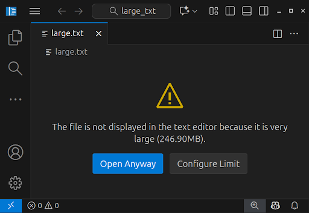

## コード全体の概要と構造

コード構成については、[こちらのドキュメント](https://github.com/microsoft/vscode/wiki/Source-Code-Organization)を参照しました。

### レイヤ分割

まず、コード全体はレイヤに分割されています。

- `base` レイヤ: 汎用的なユーティリティ関数やUIコンポーネントを提供します。
- `platform` レイヤ: ファイル読み書きやコマンド実行、ワークスペース管理などを司る Service を定義しています。
- `editor` レイヤ: 単純なコードエディタ部分の機能を提供します。
- `workbench` レイヤ: エディタ等をホストし、ファイルエクスプローラーやメニューバーなどの付加的な機能を追加します。Electronによりデスクトップアプリを実装します。また、ブラウザAPIを通じてweb版の実装も行います。
- `code` レイヤ: デスクトップアプリのエントリポイントで、全コンポーネントを統合します。
- `server` レイヤ: リモート開発用のサーバアプリのエントリポイントになります。

### 実行環境分割

次に、各レイヤーは実行環境ごとにコードがディレクトリに分割されています。

- `common`: JavaScript API のみで動くコード
- `browser` Web API が必要なコード
- `node` Node.JS API が必要なコード
- `electron-browser`: `browser` が提供する API と electron との通信用 API が必要なコード
- `electron-utility`: `node` が提供するAPI と、electron utility-process API が必要なコード
- `electron-main`: `node`, `electron-utility` が提供する API と、electron main-process API が必要なコード

### `contrib` ディレクトリ

`browser` レイヤと `workbench` レイヤには、`contrib` というディレクトリが存在しています。
ここは、必要最低限のコアコードの上に載せる機能単位の実装をまとめる場所になっています。
基本的には、ここのコードを弄ることになります。

### Dependency Injection

vscode のソースコードは、Dependency Injection (依存注入, DI) と呼ばれるデザインパターンで設計されています。

DI とは、あるクラス A が別のクラス B に依存している場合に、A 内で B を構築するのではなく、A のコンストラクタ等で B の構築済みインスタンスを引数として受けとるデザインパターンです。これにより、クラス間の結合度を低減することができます。

具体的に vscode では、`platform` が提供する Service を、各クラスのコンストラクタ引数として受け取る形で依存性を表現しています。

## 開発環境の整備

開発を開始するにあたっての環境構築では、[こちらのドキュメント](https://github.com/microsoft/vscode/wiki/How-to-Contribute)を参照しました。

上記のドキュメントに従って必要なツールのインストールとレポジトリのクローンを終えたら、ビルドと実行を行っていきます。

まずビルドは以下のコマンドで行います。

**注意: pnpm など npm 以外のものを使うと依存関係が上手く解決できずビルドに失敗する可能性があります。**

```sh
npm install # 初回のみ
npm run watch
```

このコマンドはソースコードが更新されると自動で増分ビルドを行ってくれます。
開発中はずっと実行しっぱなしにしておきます。

先述のコマンドで、`[watch-client    ] [xx:xx:xx] Finished compilation with 0 errors after x ms` のように出力されたら、別のターミナルを開いて以下のコマンドで起動します。

**注意: 紛らわしいのですが、`[watch-extensions] [xx:xx:xx] Finished compilation extensions with 0 errors after x ms` と見間違えないように注意してください。このタイミングで起動しようとしても失敗します。**

```sh
./scripts/code.sh
```

起動した vscode OSS 内では、Ctrl + Shift + I (あるいはコマンドパレット) で Chrome Developer Tools を利用することができます。
UI まわりのデバッグでは、これを使わないとかなり厳しいので重要です。

## 機能1. Tab キーで名前の変更を連続して行う

### コード箇所の特定

始めに、名前変更機能に関連するコード箇所を特定します。
ファイルエクスプローラ部分の機能なので、`workbench` レイヤに絞ります。

まず、ファイル名の編集状態に入る処理のスタート地点を探しました。
編集状態に入る際のキーボードショートカット（F2キー）に注目しました。
`F2` というキーワードでまず検索をかけ、キーボードの各キーは `base/common/keyCode.ts` に定義された `KeyCode` という enum で管理されているらしいことを把握しました。
そのため、`KeyCode.F2` というキーワードで再度検索を行いました。
その結果、`workbench/contrib/files/browser/fileActions.contribution.ts` に関連コードを発見しました。
そこから `workbench/contribu/files/browser/fileActions.ts` に定義された `renameHandler` 関数を特定しました。

次に、編集を確定して通常の状態に戻る処理のスタート地点を探しました。
ファイル名の編集中にも F2 キーを押すと処理が走る（ファイル名の選択部分が変わる）ことに注目し、再び `KeyCode.F2` の検索結果を見直しました。
その結果、`workbench/contrib/files/browser/views/explorerViewer.ts` に定義された `FilesRenderer` クラスを特定しました。

### 編集状態に入る際の処理の詳細を追う

Chrome Developer Tools を使って、`renameHandler` の冒頭にブレークポイントをセットし、ステップイン/アウト/オーバーを行いながら、編集状態に入っていく処理の詳細を調べました。

1. `renameHandler` は、`explorerService.getContext` からエクスプローラ部分で現在フォーカス中のファイルの情報を取得します。
   そして、`explorerService.setEditable` 関数に選択中のファイル情報と、編集終了時に呼んでもらうコールバック関数 (`onFinish`) を渡します。
1. `explorerService.setEditable` 関数は、指定されたファイルを「編集状態」として、`onFinish` と共に内部に記憶しておきます。
   そのうえで、`ExplorerView.setEditable` 関数に編集したいファイルの情報を転送します。
   ※「編集状態」にあるファイルは多くても1つのみです。
1. `ExplorerView.setEditable` 関数は、渡されたファイルの**親ディレクトリ**を指定して、エクスプローラのツリーコンポーネントについて、そのディレクトリ以下の部分の再レンダリングを走らせます。
   このタイミングで「どのファイルを編集したいのか」という情報は、引数からは失われます。
1. かなりのコールスタックを積み重ねて、ツリーの再レンダリング処理は `workbench/contrib/files/browser/views/explorerViewer.ts` の `FilesRenderer.renderElement` 関数に至ります。
   ここで `explorerSerivice.getEditableData` 関数により、「編集状態」にあるファイルの情報を問い合わせて取得します。
   そして、これに一致するファイルのツリーコンポーネントの場合のみ、`FilesRenderer.renderInputBox` 関数を呼び出します。
   この際に、先述の `onFinish` も渡します。
1. 編集したいファイルのエクスプローラ内コンポーネントの位置に、ファイル名の編集用の入力ボックスが表示されます。

`FilesRenderer.renderElement` で `explorerService` に再問合せしているという構造を把握するまで、
「編集したいファイルの情報が引数から抜け落ちてしまっているのにどうして編集したいファイルが分かるんだろう？」とかなり混乱させられました。

また、再レンダリングの制御フローを調べる際、はじめは一つずつステップイン等を使って追っていました。
しかし、再帰呼び出しが多く存在しており、ゴールである `renderInputBox` に至るまでの全体像がなかなか把握できませんでした。
そこで `renderInputBox` の冒頭にブレークポイントを置いて、その時点におけるコールスタックを確認する方法に切り替えました。
これにより、`renameHandler` から `renderInputBox` までの制御フローを一気に確認することができ、処理の要となる `FilesRenderer.renderElement` 関数を効率的に発見できました。

### 編集状態を終える際の処理の詳細を追う

同様に Chrome Developer Tools を使って調べました。

1. 編集状態でエンターキーやエスケープキーを押すと、`FilesRenderer.renderInputBox` 内の `DOM.addStandardDisposableListener(inputBox.inputElement, DOM.EventType.KEY_DOWN, (e: IKeyboardEvent)` の箇所で定義されているリスナーがトリガされ、結果として `done` 関数が呼ばれます。
1. `done` 関数では、入力ボックスの中身（新しいファイル名）などを引数に渡して `onFinish` を呼び出します。
1. `onFinish` は、ファイルの読み書きAPIを呼んでファイル名の変更を行った後、`explorerService.setEditable` に `null` を渡して「編集状態」をクリアします。

### コード変更

以上の調査結果を踏まえて、現在編集中のファイルの次のファイルを `explorerService.setEditable` に渡してツリーの再レンダリングを発生させれば良いだろうという見当を立てました。

まず、`FilesRenderer.renderInputBox` 内の先述のリスナーに、Tab キーのリスナーを追加し、基本的な動作は Enter キーと同様に設定しました。

始めは、この Tab キーの処理部分に直接、次ファイルの `setEditable` 呼び出しを実装していました。
しかし、Chrome Developer Tools でブレークポイントを貼って確認したところ、Tab キーを押すと計 4 回もの再レンダリングが走ってしまう現象が発生しました。
このとき、次ファイルの入力ボックスは表示されるものの、複数回の再レンダリングの影響からかファイル名の部分が選択状態になっておらず、このままでは非常に編集がしづらい状態でした。

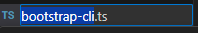
選択状態にある入力ボックスの例

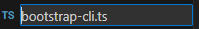
選択状態が外れてしまった入力ボックスの例

Chrome Developer Tools でブレークポイントを貼りながら、各レンダリングがどこから来たものか調査を試みました。
しかし、その処理はイベントをリッスンして管理する抽象的なクラスから開始していました。
このクラスのせいで、イベントをリッスンするように登録した箇所とは関係性が断絶していました。
張られているリスナーやトリガの関係を、この先まで調べる方法が分からず、正確な原因究明には至りませんでした。
根本的な原因は、`setEditable` による呼び出しによって発生する再レンダリングに伴い、リスナー自身が抹消されるという構造にあったのではないかと推測しています。

このような問題のため、別の設計を模索した結果、
`onFinish` の内部で `explorerService.setEditable` に `null` を渡して「編集状態」をクリアしている部分に注目するに至りました。
この部分で次ファイル情報を `null` の代わりに渡せば、既存のコードと全く同じタイミングで再レンダリングを走らせることができるためです。

結論から言うと、このやり方が上手く動作しました。以降で少し具体的な実装内容を紹介します。

`onFinish` 内で次ファイルを取得するにあたっては、既存コードの「フォーカス中のファイル情報の取得」の機能を再利用するために、「フォーカスを１つ進める」という処理を、情報取得前に入れることで実装しました。
具体的には、以下のようにして実装しました。
この部分に関しては、Github Copilot を利用して類似のコード箇所を検索してもらい、それを参考にしました。

```ts
const viewsService = accessor.get(IViewsService); // accessor は既存コードで renameHandler の引数として与えられている
const view = viewsService.getViewWithId(VIEW_ID); // VIEW_ID は workbench/contrib/files/common/files.ts に既存定義がある
const explorerView = view as ExplorerView;
explorerView.focusNext();
const next_stats = explorerService.getContext(false); // 次ファイル情報
```

そして `onFinish` の引数に `have_next: boolean` を追加し、false の場合には既存コードと同様の処理を行い、true の場合には上記で取得した次ファイル情報を使って `explorerService.setEditable` を呼ぶように変更しました。

`done` でも `next: boolean` を引数に追加して内部の `onFinish` の呼び出しの際に `have_next` に転送するようにしておき、既存コードにおける `done` の呼び出しでは全て false、Tabキーから呼ぶ箇所だけ true にセットしました。

このとき、Tab キーのデフォルト動作である「フォーカスを次のコンポーネントに移動する」という動作を以下のコードによって無効化する必要があります。

```ts
e.preventDefault();
```

実は `FilesRenderer.renderInputBox` には、「この入力ボックスからフォーカスが外れた場合には編集状態をキャンセルして終了する」という処理を走らせるためのリスナーが存在しています。
このリスナーのおかげで、編集中にエディタ部分をクリックしたりすると、自動でファイル名の編集状態を終了してくれたりするのですが、これが上記の Tab キーのデフォルト動作と致命的なミスマッチとなってしまいます。
そのため、無効化を入れる必要がありました。
これの把握にもかなり時間を要してしまいました。

### 完成品

以上のコード変更によって、このように目標の機能を実装することができました。
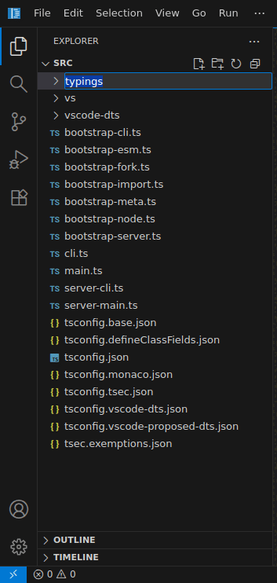

## 機能2. 巨大ファイルをメモリ消費を抑えつつプレビューする

### 既存のvscodeの説明

vscodeは既存の状態においても、大容量fileを開くときに一部最適化をおこなっており、
Tokenizationの機能が無効化されています。

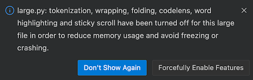

Tokenizationとは、文章の中から単語や文節などの意味のある単位（トークン）を抽出する処理のことです。
vscodeでは、このTokenizationを利用して、シンタックスハイライトやコード補完、リンターなどの機能を実現しています。

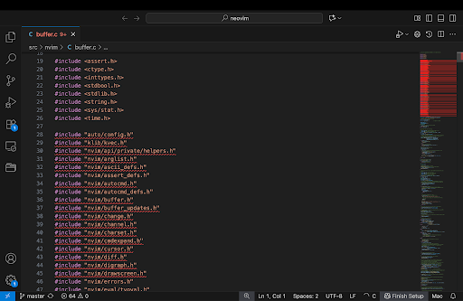

しかし、大容量fileに対してTokenizationを行うと、メモリ消費が増大し、パフォーマンスが低下する可能性があります。
そのため、vscodeは大容量fileを開くときに、Tokenizationを無効化し、メモリ消費を抑えるようにしています。(参考: vscode/src/vs/editor/common/model/testModel.ts:L340)

また、上記で述べたように、vscodeのすべてのbufferはメモリ上に読み込まれるようになっており、
現状では、巨大fileを開くときに、メモリ消費が増大し、クラッシュする可能性があります。

また、巨大fileを開くときに、読み込み時間が長くなり、ユーザビリティが低下する可能性があります。

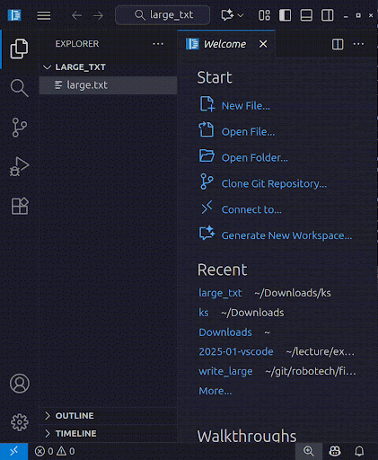

### コード変更箇所の特定

#### file読み込み部分の特定

```bash
rg readFile -g '*.ts' --max-filesize=1M
```

上記のコマンドを実行し、vscodeのソースコード全体からreadFileに関するコードを検索し、
それらの中から関連度の高そうなコードにbreakpointを設定し、実際にfileを開いたときに、
どのコードが実行されるかを調査しました。

その結果、`src/vs/platform/files/common/fileService.ts`がinterfaceとして、

```ts
FileService.readFile;
FileService.readFileStream;
FileService.readFileBuffer;
FileService.readFileUnbuffered;
```

等の関数を提供しており、mac及び、linuxのDesktop versionにおけるfileの読み出しの実態は、`src/vs/platform/files/common/diskFileSystemProviderClient.ts`にある、

```ts
DiskFileSystemProviderClient.readFileStream;
```

が呼び出されていることがわかりました。

#### file書き込みの制限部分の特定

こちらのほうは、file権限の管理を行っているコードの調査を上記で見つけた、`src/vs/platform/files/common/fileService.ts`から調査を始めました。
その中で、fileの権限を管理しているコードとして、

```ts
FileService.validateReadFile;
```

があり、この関数がfileが "Readonly" かどうかを判定していることがわかりました。

最終的に、frontend側でfileの書き込みを制限しているコードは、
`/src/vs/workbench/services/filesConfiguration/common/filesConfigurationService.ts`の中の、

```ts
FilesConfigurationService.isReadonly;
```

であることがわかりました。

### 読み込みの制限の実装

もともとの`src/vs/platform/files/common/diskFileSystemProviderClient.ts`の中の、
`readFileStream`関数は、以下のようになっています。

```ts
	readFileStream(resource: URI, opts: IFileReadStreamOptions, token: CancellationToken): ReadableStreamEvents<Uint8Array> {
		const stream = newWriteableStream<Uint8Array>(data => VSBuffer.concat(data.map(data => VSBuffer.wrap(data))).buffer);
		const disposables = new DisposableStore();

		// Reading as file stream goes through an event to the remote side
		disposables.add(this.channel.listen<ReadableStreamEventPayload<VSBuffer>>('readFileStream', [resource, opts])(dataOrErrorOrEnd => {

			// data
			if (dataOrErrorOrEnd instanceof VSBuffer) {
				stream.write(dataOrErrorOrEnd.buffer);
			}

			// end or error
			else {
				if (dataOrErrorOrEnd === 'end') {
					stream.end();
				} else {
					let error: Error;

					/// ...Error処理の省略...
				}

				// Signal to the remote side that we no longer listen
				disposables.dispose();
			}
		}));

		/// ... 省略 ...

		return stream;
	}
```

流れとしては、

1. `readFileStream`関数が呼び出される
1. streamオブジェクトを生成
1. 非同期で、remote sideからfileのdataを受け取るためのlistenerを登録
   - listener内で、dataを受け取ったらstreamに書き込み、end or errorを受け取ったらstreamを閉じる
1. streamオブジェクトを返す

となっています。

この流れの中で、fileの読み込みを制限するために、listener内でdataを受け取ったときに、
読み込んだdataのサイズが、あらかじめ設定した閾値を超えていたら、streamに書き込まないようにしました。
具体的には、以下のように実装しました。

```ts
	readFileStream(resource: URI, opts: IFileReadStreamOptions, token: CancellationToken): ReadableStreamEvents<Uint8Array> {
		/// ... 省略 ...

		// 追加部分: 読み込み可能なbyte数の上限を設定
		let bytesRemain = opts.limits?.size ?? Number.MAX_SAFE_INTEGER;
		// Reading as file stream goes through an event to the remote side
		disposables.add(this.channel.listen<ReadableStreamEventPayload<VSBuffer>>('readFileStream', [resource, opts])(dataOrErrorOrEnd => {

			// data
			if (dataOrErrorOrEnd instanceof VSBuffer) {
				// 追加部分: 読み込み可能なbyte数を超えていたら、streamに書き込まない
				if (bytesRemain < dataOrErrorOrEnd.byteLength) {
					stream.write(dataOrErrorOrEnd.slice(0, bytesRemain).buffer);
					bytesRemain = 0;
					stream.end();
				} else {
					stream.write(dataOrErrorOrEnd.buffer);
					bytesRemain -= dataOrErrorOrEnd.byteLength;
				}
			}

			// end or error
			else {
				/// ... End or error 処理 ...
			}
		}));

		/// ... 省略 ...

		return stream;
	}
```

### editの制限の実装

もともとの`/src/vs/workbench/services/filesConfiguration/common/filesConfigurationService.ts`の中の、

```ts
	isReadonly(resource: URI, stat?: IBaseFileStat): boolean | IMarkdownString {

		// if the entire file system provider is readonly, we respect that
		// and do not allow to change readonly. we take this as a hint that
		// the provider has no capabilities of writing.
		const provider = this.fileService.getProvider(resource.scheme);
		if (provider && hasReadonlyCapability(provider)) {
			return provider.readOnlyMessage ?? FilesConfigurationService.READONLY_MESSAGES.providerReadonly;
		}

		// session override always wins over the others
		const sessionReadonlyOverride = this.sessionReadonlyOverrides.get(resource);
		if (typeof sessionReadonlyOverride === 'boolean') {
			return sessionReadonlyOverride === true ? FilesConfigurationService.READONLY_MESSAGES.sessionReadonly : false;
		}
		/// ... 省略 ...

		return false;
	}
```

の中で、fileが"Readonly"かどうかを判定しています。

いくつかの条件でfileが"Readonly"になるようになっていますが、
上で表示しているものは、file system provider自体が"Readonly"である場合と、
session overrideで"Readonly"に設定されている場合の判定を行っています。

ここで、file sizeがあらかじめ設定した閾値を超えていたら、"Readonly"と判定するようにし、また、session overrideでoverrideできるようにするために、
以下のように実装しました。

```ts
	isReadonly(resource: URI, stat?: IBaseFileStat): boolean | IMarkdownString {

		/// ...system provider readonlyの判定部分...

		// session override always wins over the others
		const sessionReadonlyOverride = this.sessionReadonlyOverrides.get(resource);
		if (typeof sessionReadonlyOverride === 'boolean') {
			return sessionReadonlyOverride === true ? FilesConfigurationService.READONLY_MESSAGES.sessionReadonly : false;
		}
		/// ... 省略 ...

		// 追加部分: file sizeが閾値を超えていたら、Readonlyと判定
		const configuredSizeLimitMb = this.textResourceConfigurationService.inspect<number>(resource, null, 'workbench.editorLargeFileConfirmation');
		const bufferLimit = configuredSizeLimitMb?.value ? configuredSizeLimitMb.value * 1024 * 1024 : Number.MAX_SAFE_INTEGER;
		if (stat!==undefined && stat.size!==undefined
			&& stat.size > bufferLimit) {
			return FilesConfigurationService.READONLY_MESSAGES.fileLockedLargeFile;
		}

		/// ... 省略 ...

		return false;
	}
```

なお、`FilesConfigurationService.READONLY_MESSAGES.fileLockedLargeFile`は、

```ts
		fileLockedLargeFile: { value: localize({ key: 'fileLockedLargeFile', comment: ['Please do not translate the word "command", it is part of our internal syntax which must not change', '{Locked="](command:{0})"}'] }, "Editor is read-only because the file is large. [Click here](command:{0}) to set writeable anyway.", 'workbench.action.files.setActiveEditorWriteableInSession'), isTrusted: true },
```

のように定義しました。
これは、fileが大容量fileであるときに表示されるメッセージであり、
"Click here"の部分をクリックすると、`workbench.action.files.setActiveEditorWriteableInSession`コマンドが実行され、
session overrideで、fileをwriteableに設定することができます。
このようにすることで、大容量fileであっても、ユーザが明示的にwriteableに設定した場合には、編集可能にすることができます。

### 完成品

以上のコード変更によって、巨大fileをメモリ消費を抑えつつプレビューする機能を実装することができました。
具体的には、以下のように動作します。

fileの横に鍵マークが表示されるようになり、fileがread-onlyであることを示しています。

また、途中までしかレンダリングされていないために、例1では途中で数字が切れています。
例２では変更前のほうが"THE END"まで表示されているのに対し、変更後ではそれが表示されず、文章が途中で切れていることがわかります。

#### 例1

- 変更前


- 変更後

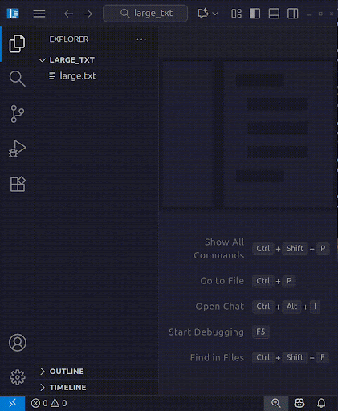

#### 例2

- 変更前

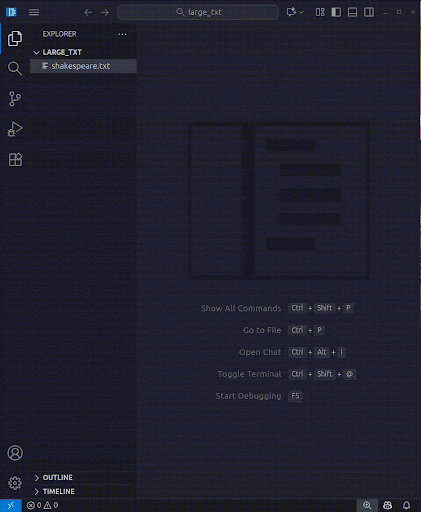

- 変更後

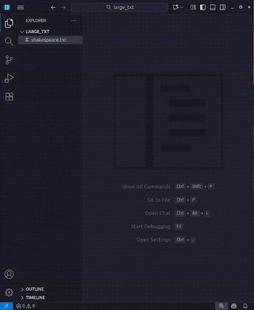

## おわりに

### 感想

今回の開発を通じて、巨大なソフトウェアを理解する際には、
既存の実装にどのようなユーティリティ関数が用意されているかを把握することが
非常に難しいと実感しました。
小規模なソフトウェアであれば、ユーティリティ関数の把握は比較的容易ですが、
規模が大きくなるにつれて、関数の数が増え、
どの階層でどのリソースが利用可能なのか、
どの関数を呼ぶことができるのかを把握するのが困難になってきます。

また、TypeScriptで記述されたコードの実行フローを理解するために、
Chrome Developer Toolsの活用方法を学びました。
Chrome Developer Toolsを使うことで、ブレークポイントの設定、
コールスタックの確認、変数の値のチェックなどが可能となり、
複雑なフローの把握が容易になりました。

さらに、今回対象としたvscodeはGUIアプリケーションであり、
普段はC++のCUIアプリケーションを扱うことが多い我々にとって、
GUIアプリケーションの開発やデバッグ手法を学ぶ良い機会となりました。
加えて、TypeScriptの型システムや非同期処理の扱い方についても理解を深めることができました。

### 今後の展望

#### 機能1について

#### 機能2について

## 参考文献やサイトなど

- https://github.com/microsoft/vscode
- https://ja.wikipedia.org/wiki/Visual_Studio_Code
- https://survey.stackoverflow.co/2025/technology#1-dev-id-es
- https://github.com/microsoft/vscode/wiki/How-to-Contribute
- https://github.com/microsoft/vscode/wiki/Source-Code-Organization
